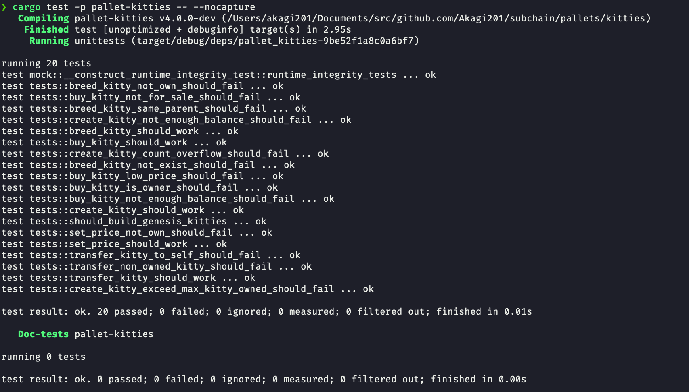

# Kitties Pallet

## 题目

1. 增加买和卖的 extrinsic，对视频中 kitties 的实现进行重构，提取出公共代码

2. KittyIndex 不在 pallet 中指定，而是在 runtime 里面绑定

3. 测试代码能测试所有的五个方法，能检查所有定义的 event，能测试出所有定义的错误类型

4. 引入 Balances 里面的方法，在创建时质押一定数量的 token，在购买时支付 token

## cargo test

```bash
cargo test -p pallet-kitties -- --nocapture # make println! in test works
```
## 测试结果


