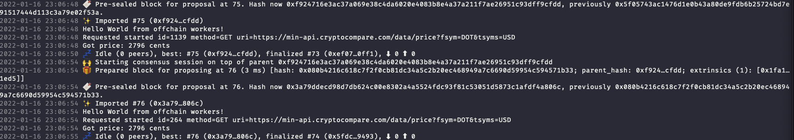

# offchain-worker

## Features

利用 offchain worker 取出 DOT/USDT 价格，写入到 Vec，提交回链上，只保留最近 10 个价格。

## Build

```bash
cargo build --release
```

## Run

  > 注意：需要开启代理



## Refs

参考: <https://github.com/tsurog/substrate-ocw/blob/main/assignment/pallets/ocw/src/lib.rs>
