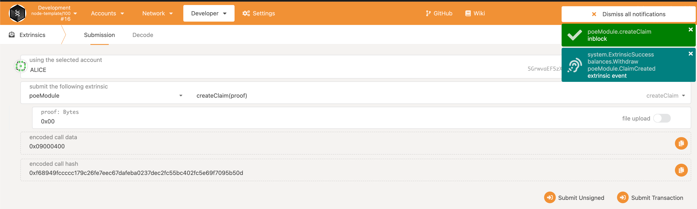

# POE

Proof Of Existence

## 节点运行

## 初始状态

## 创建存证

## 创建存证后状态

## 撤销存证

## 撤销存证后状态

## 转移存证

## 转移存证后状态

## 存证过长

## POE 单元测试

## Substrate tutorial

* [POE](https://docs.substrate.io/tutorials/v3/proof-of-existence/)

## Related Projects

* [Bitcoin file POE](https://poex.io/)
